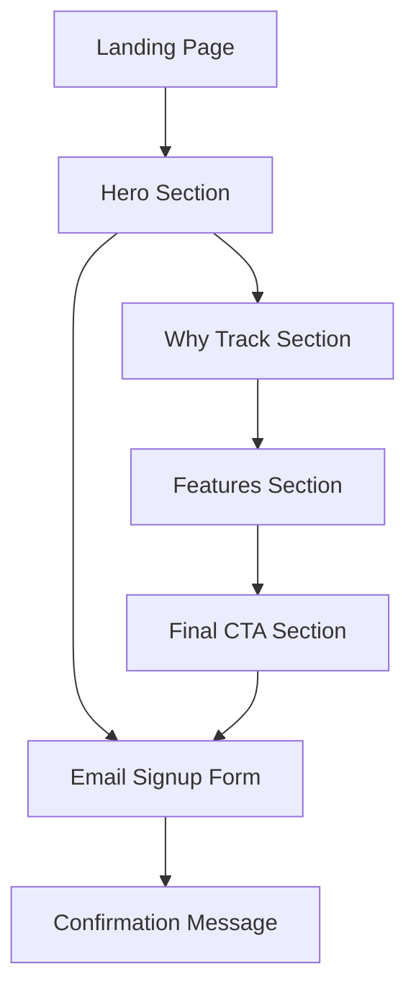

# PeePeePal Landing Page - Product Requirements Document

## 1. Product Overview

PeePeePal is a fun, minimal, and modern landing page for a mobile app that tracks bathroom visits, hydration levels, and weekly patterns in a lighthearted way. The landing page serves as the primary marketing tool to attract early users and communicate the app's unique value proposition with humor and health benefits.

## 2. Core Features

### 2.1 User Roles

No user role distinction is necessary for this landing page - it targets all potential app users.

### 2.2 Feature Module

Our PeePeePal landing page consists of the following main sections:

1. **Hero Section**: Main headline, subheadline, primary CTA button, and phone mockup display.
2. **Why Track Section**: Four benefit cards with playful icons and explanatory text.
3. **Features Section**: Three feature cards highlighting core app capabilities.
4. **Final CTA Section**: Secondary call-to-action with compelling messaging.
5. **Email Signup Form**: Modal or embedded form for early access registration.

### 2.3 Page Details

| Page Name    | Module Name       | Feature description                                                                                                                                                                                         |
| ------------ | ----------------- | ----------------------------------------------------------------------------------------------------------------------------------------------------------------------------------------------------------- |
| Landing Page | Hero Section      | Display main headline "Know your gut. Literally." with subheadline "Track every visit. Stay healthy. Laugh a little." Include prominent "Get Early Access 🚀" button and phone mockup showing app interface |
| Landing Page | Phone Mockup      | Show visual representation of app interface including visit log, hydration reminder, and weekly chart displays                                                                                              |
| Landing Page | Why Track Section | Present four benefit cards with icons: Stay hydrated 💧, Spot health changes ❤️, Discover daily schedule ⏰, Have fun with it 😄                                                                             |
| Landing Page | Features Section  | Display three feature cards: "Daily Logging", "Weekly Trends & Charts", "Privacy First" with descriptions                                                                                                   |
| Landing Page | Final CTA Section | Show compelling message "Your toilet routine says more about your health than you think. Be the first to track it." with secondary CTA                                                                      |
| Landing Page | Email Signup Form | Collect email addresses for early access with validation and confirmation messaging                                                                                                                         |

## 3. Core Process

The main user flow is straightforward:

1. User lands on the homepage and reads the hero section
2. User scrolls through "Why Track This?" section to understand benefits
3. User reviews features section to understand app capabilities
4. User clicks "Get Early Access" button to open email signup form
5. User submits email and receives confirmation

## 4. User Interface Design

### 4.1 Design Style

* **Primary Colors**: Light blue (#87CEEB), white (#FFFFFF)

* **Secondary Colors**: Soft gradients (light blue to white), playful accent colors

* **Button Style**: Rounded corners with gradient backgrounds, bold text

* **Font**: Bold, friendly, and approachable typography (suggested: Inter, Poppins, or similar)

* **Font Sizes**: Large headlines (32-48px), medium subheadings (18-24px), readable body text (16px)

* **Layout Style**: Centered content, card-based sections, generous white space

* **Icons**: Playful emoji-style icons with consistent sizing

### 4.2 Page Design Overview

| Page Name    | Module Name       | UI Elements                                                                                                                       |
| ------------ | ----------------- | --------------------------------------------------------------------------------------------------------------------------------- |
| Landing Page | Hero Section      | Large bold headline in dark text, lighter subheadline, gradient CTA button with rounded corners, phone mockup with shadow effects |
| Landing Page | Why Track Section | Four cards in grid layout with large emoji icons, bold titles, and descriptive text in light blue accent color                    |
| Landing Page | Features Section  | Three cards with subtle shadows, icons, bold titles, and explanatory text with consistent spacing                                 |
| Landing Page | Final CTA Section | Centered text with emphasis styling, secondary CTA button with different color treatment                                          |
| Landing Page | Email Signup Form | Clean modal or inline form with input field, submit button, and success/error states                                              |

### 4.3 Responsiveness

The landing page is mobile-first with responsive design:

* Desktop: Multi-column layouts for sections, larger typography

* Tablet: Adjusted grid layouts, medium typography

* Mobile: Single-column stacked layout, optimized touch targets, readable font sizes

* Touch interaction optimization for all interactive elements

* Smooth scrolling and transitions between sections

