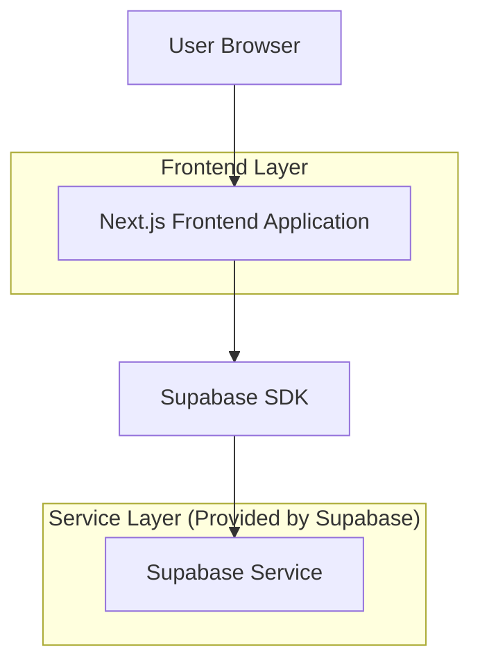
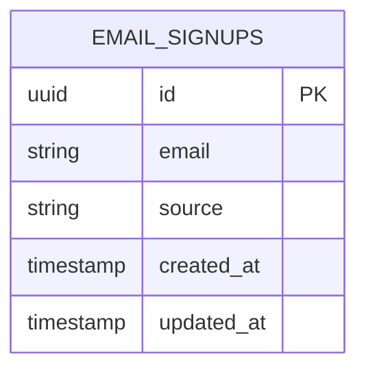

# PeePeePal Landing Page - Technical Architecture Document

## 1. Architecture Design



## 2. Technology Description

* Frontend: Next.js\@14 + React\@18 + TypeScript + Tailwind CSS\@3

* Backend: Supabase (for email collection and form handling)

* Deployment: Vercel (optimized for Next.js)

## 3. Route Definitions

| Route       | Purpose                                                   |
| ----------- | --------------------------------------------------------- |
| /           | Main landing page with all sections (hero, features, CTA) |
| /api/signup | API endpoint for email signup form submission             |

## 4. API Definitions

### 4.1 Core API

Email signup endpoint

```
POST /api/signup
```

Request:

| Param Name | Param Type | isRequired | Description                           |
| ---------- | ---------- | ---------- | ------------------------------------- |
| email      | string     | true       | User's email address for early access |
| source     | string     | false      | Source of signup (hero, footer, etc.) |

Response:

| Param Name | Param Type | Description                   |
| ---------- | ---------- | ----------------------------- |
| success    | boolean    | Whether signup was successful |
| message    | string     | Success or error message      |

Example Request:

```json
{
  "email": "user@example.com",
  "source": "hero_cta"
}
```

Example Response:

```json
{
  "success": true,
  "message": "Successfully signed up for early access!"
}
```

## 5. Data Model

### 5.1 Data Model Definition



### 5.2 Data Definition Language

Email Signups Table (email\_signups)

```sql
-- Create table
CREATE TABLE email_signups (
    id UUID PRIMARY KEY DEFAULT gen_random_uuid(),
    email VARCHAR(255) UNIQUE NOT NULL,
    source VARCHAR(50) DEFAULT 'unknown',
    created_at TIMESTAMP WITH TIME ZONE DEFAULT NOW(),
    updated_at TIMESTAMP WITH TIME ZONE DEFAULT NOW()
);

-- Create indexes
CREATE INDEX idx_email_signups_email ON email_signups(email);
CREATE INDEX idx_email_signups_created_at ON email_signups(created_at DESC);
CREATE INDEX idx_email_signups_source ON email_signups(source);

-- Grant permissions
GRANT SELECT ON email_signups TO anon;
GRANT ALL PRIVILEGES ON email_signups TO authenticated;

-- Row Level Security (RLS)
ALTER TABLE email_signups ENABLE ROW LEVEL SECURITY;

-- Policy for inserting new signups (allow anonymous users)
CREATE POLICY "Allow anonymous email signups" ON email_signups
    FOR INSERT TO anon
    WITH CHECK (true);
```

## 6. Component Architecture

### 6.1 Component Structure

```
src/
├── app/
│   ├── layout.tsx          # Root layout with metadata
│   ├── page.tsx            # Main landing page
│   ├── globals.css         # Global styles
│   └── api/
│       └── signup/
│           └── route.ts    # Email signup API endpoint
├── components/
│   ├── HeroSection.tsx     # Hero section with CTA
│   ├── PhoneMockup.tsx     # App interface mockup
│   ├── WhyTrackSection.tsx # Benefits section
│   ├── FeaturesSection.tsx # Features cards
│   ├── FinalCTA.tsx        # Final call-to-action
│   ├── EmailSignupForm.tsx # Email collection form
│   └── ui/
│       ├── Button.tsx      # Reusable button component
│       ├── Card.tsx        # Reusable card component
│       └── Modal.tsx       # Modal for signup form
├── lib/
│   ├── supabase.ts         # Supabase client configuration
│   └── utils.ts            # Utility functions
└── types/
    └── index.ts            # TypeScript type definitions
```

### 6.2 Key Dependencies

```json
{
  "dependencies": {
    "next": "^14.0.0",
    "react": "^18.0.0",
    "react-dom": "^18.0.0",
    "@supabase/supabase-js": "^2.0.0",
    "tailwindcss": "^3.0.0",
    "framer-motion": "^10.0.0",
    "react-hook-form": "^7.0.0",
    "zod": "^3.0.0"
  },
  "devDependencies": {
    "typescript": "^5.0.0",
    "@types/react": "^18.0.0",
    "@types/node": "^20.0.0",
    "eslint": "^8.0.0",
    "eslint-config-next": "^14.0.0"
  }
}
```

